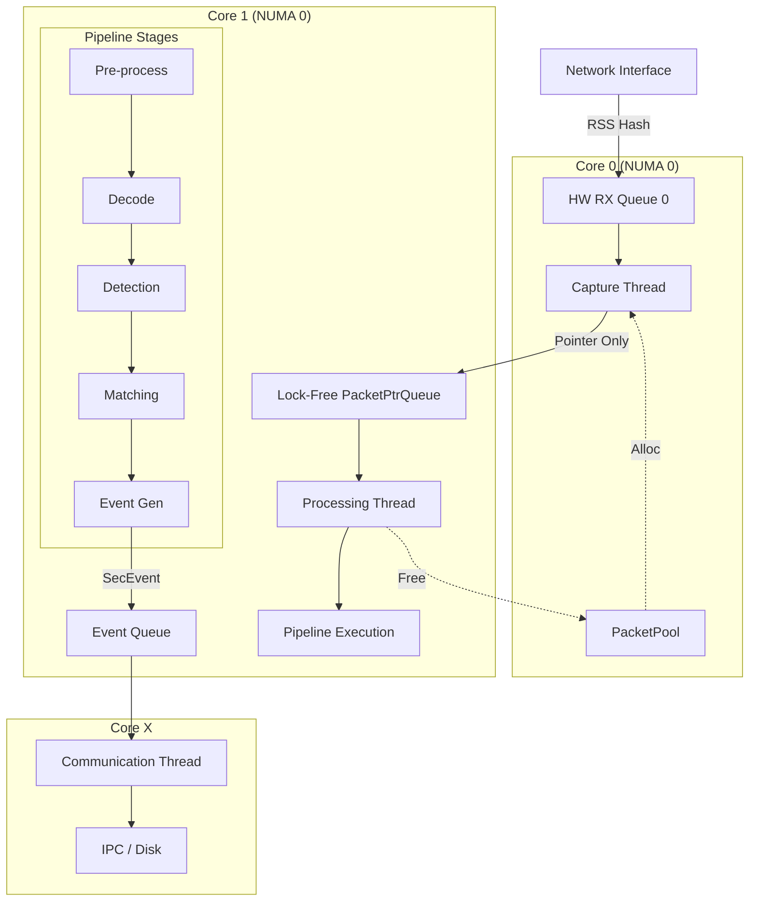

# NIDS High-Performance Packet Processing Architecture Design

## 1. Design Thoughts <设计思路>

### 1.1 Architecture Pattern Selection
We adopt a **Hybrid Pipeline-Task Parallelism** pattern combined with **Data-Oriented Design (DOD)**.

*   **Pipeline Pattern**: The packet processing lifecycle is naturally sequential (Capture -> Filter -> Decode -> Detect). A pipeline architecture allows for clear separation of concerns, enabling individual stages to be developed, tested, and optimized independently.
*   **Producer-Consumer Model**: Between the Capture Thread and the Processing Thread, we use a high-performance ring buffer (PacketPtrQueue). This decouples the high-speed capture from the CPU-intensive analysis.
*   **Data-Oriented Design**: Instead of heavy object-oriented encapsulation for packets, we use a flat memory model (`PacketSlot`) managed by a central pool (`PacketPool`). This ensures cache locality and minimizes memory fragmentation.

### 1.2 Core Components Identification
*   **Pipeline Abstraction Layer**:
    *   `IPipeline`: Manages the lifecycle and ordering of stages.
    *   `IStage`: The atomic unit of work. Each stage (e.g., `DecodeStage`, `DetectionStage`) implements this interface.
    *   `Context`: A transient context object passed through the pipeline tailored for the current packet, holding intermediate results (parsed headers, flow keys).

*   **Data Flow Mechanism**:
    *   `PacketPool`: A pre-allocated, NUMA-aware memory pool containing fixed-size blocks.
    *   `PacketSlot`: The actual container for packet data. Supporting multiple sizes (256B, ..., 2048B) to optimize memory usage.
    *   `PacketPtrQueue`: A lock-free, single-producer single-consumer (SPSC) queue storing pointers to `PacketSlots`. This is the critical link between threads.

*   **Extension Points**:
    *   Dynamic Stage Loading: Stages can be enabled/disabled via atomic flags at runtime.
    *   Plugin Interface: `IStage` allows loading external shared libraries for custom detection logic.

### 1.3 Data Flow Path
1.  **Capture Phase**: NIC -> Capture Thread -> `PacketPool::alloc()` -> Write Packet Data -> `PacketPtrQueue::push()`.
2.  **Processing Phase**: Processing Thread -> `PacketPtrQueue::pop()` -> `Pipeline::execute()` -> [Preprocess -> Decode -> Detect -> Match -> Event] -> `PacketPool::free()`.

### 1.4 Key Design Decisions per Stage

| Stage | Input | Output | Core Logic | Performance Bottlenecks & Optimization |
| :--- | :--- | :--- | :--- | :--- |
| **Capture** | Raw Network Signal | `PacketSlot*` | Read from NIC ring, copy to PacketSlot, Timestamp. | Memory copy speed. **Opt**: DPDK/PF_RING ZC, variable slot sizing. |
| **Preprocess** | `PacketSlot*` | Sanitized Packet | Checksum verification, defragmentation (simple), sanity checks. | Branch misprediction. **Opt**: Omit checks for trusted internal traffic (configurable). |
| **Decode** | `PacketSlot*` | `HeaderXX` Structs | Parse Eth, IP, TCP/UDP headers. Extract 5-tuple. | Parsing depth. **Opt**: Parsing only needed headers; SIMD for field extraction. |
| **Detection** | `Decoded Packet` | Alerts/Flow State | DDoS heuristics, stateful flow tracking (TCP reassembly). | Hash table collisions (Flow table). **Opt**: Cuckoo hashing, pre-calculated 5-tuple hash. |
| **Matching** | `Payload` + `Flow` | Snort Rules | Aho-Corasick/Hyperscan for signature matching. | Pattern matching on payload. **Opt**: Hyperscan library, confirm match only if flow state allows. |
| **Event Gen** | `Match Result` | `SecEvent` Object | Aggregation, suppression, formatting JSON/Protobuf. | IPC overhead. **Opt**: Batch processing, zero-copy IPC ring buffer. |

## 2. Abstract Interface Design <抽象设计>

### 2.1 Core Interfaces

```cpp
/**
 * @brief Represents a slot in the memory pool.
 * Designed to be POD-like for cache efficiency.
 */
struct PacketSlot {
    uint8_t* data;          // Pointer to actual data buffer
    uint32_t capacity;      // Total size of the buffer
    uint32_t length;        // Actual length of packet
    uint64_t timestamp;     // Nanosecond timestamp
    uint32_t flowHash;      // Pre-calculated hash for flow tracking
    // ... metadata for zero-copy reference counting if needed
};

/**
 * @brief Context passed through the pipeline stages.
 * Holds transient data derived during processing to avoid re-parsing.
 */
struct PipelineContext {
    PacketSlot* packet;
    bool drop;              // Flag to signal early drop
    void* flowEntry;        // Pointer to associated flow table entry
    std::vector<int> matchedRuleIds;
    // ... Decoded headers pointers
};

/**
 * @brief Interface for all processing stages.
 */
class IStage {
public:
    virtual ~IStage() = default;

    /**
     * @brief Initialize stage.
     * @return true if initialization successful.
     */
    virtual bool init(const std::string& config) = 0;

    /**
     * @brief Execute stage logic on the context.
     * @param ctx The packet context.
     * @return true to continue pipeline, false to stop processing this packet.
     */
    virtual bool process(PipelineContext& ctx) = 0;

    /**
     * @brief Get stage name for monitoring.
     */
    virtual std::string getName() const = 0;
};

/**
 * @brief Manages the sequence of stages.
 */
class IPipeline {
public:
    virtual void addStage(std::shared_ptr<IStage> stage) = 0;
    virtual void run(PacketSlot* packet) = 0;
};

/**
 * @brief Memory Pool Interface.
 */
class IPacketPool {
public:
    virtual PacketSlot* allocate(size_t size) = 0;
    virtual void free(PacketSlot* slot) = 0;
};
```

### 2.2 Stage-Specific Interfaces (Examples)

```cpp
// Decoding Stage
class IDecoder : public IStage {
public:
    // Specific method to access parsed headers if needed externally
    virtual const EthernetHeader* getEthernetHeader(const PipelineContext& ctx) = 0;
};

// Match Engine Stage (Snort3 Adapter)
class IMatcher : public IStage {
public:
    virtual void loadRules(const std::string& ruleFile) = 0;
    virtual void updateRules(const std::string& ruleBlob) = 0; // Hot update
};
```

### 2.3 Extension Mechanism
*   **Factory Pattern**: A `StageFactory` registry allows creating stages by string name string, facilitating configuration-driven pipelines.
*   **Decorator Pattern**: Can wrap `IStage` with a `MonitoringDecorator` to transparently add timing metrics without modifying stage logic.

## 3. Pipeline Orchestration <管道编排>

### 3.1 Thread Model Strategy
Based on the `{{THREAD_CONFIG}}`, we implement a strict role separation:

1.  **Capture Thread (Producer)**
    *   **Core Duty**: Fastest possible acquisition.
    *   **Affinity**: Bound to the CPU core closest to the NIC PCIe lane.
    *   **Logic**:
        ```cpp
        while (running) {
            PacketSlot* slot = pool->allocate(MAX_Mtu); // O(1) alloc
            if (nic->receive(slot)) {
                queue->push(slot); // Lock-free push
            } else {
                pool->free(slot);
            }
        }
        ```

2.  **Processing Thread (Consumer)**
    *   **Core Duty**: CPU-intensive analysis.
    *   **Affinity**: Bound to a sibling hyper-thread or adjacent core to the capture thread (share L3 cache).
    *   **Logic**:
        ```cpp
        while (running) {
            PacketSlot* slot;
            if (queue->pop(slot)) { // Batch pop preferred
                pipeline->run(slot);
                pool->free(slot);
            }
        }
        ```

3.  **Communication Thread**:
    *   Handles "Slow path" operations: Logging to disk, sending stats to Prometheus/Grafana, receiving IPC commands.
    *   Decoupled from the "Fast path" (processing thread) via separate async queues.

### 3.2 Load Balancing & Flow Consistency
Since the spec implies *one* pipeline per NIC with dedicated threads, hardware RSS (Receive Side Scaling) is utilized.
*   **HW RSS**: Configure NIC to hash packet 5-tuple and distribute to specific RX queues.
*   **1-to-1 Mapping**: NIC RX Queue[i] -> Capture Thread[i] -> SPSC Queue[i] -> Processing Thread[i].
*   **Reason**: Ensures all packets of a TCP flow land on the same thread, eliminating the need for flow-table locking.

### 3.3 Data Flow Diagram



### 3.4 Synchronization & Flow Control
*   **Queue Full (Backpressure)**: If `PacketPtrQueue` becomes full (Processing thread too slow), the Capture thread **must drop packets**.
    *   *Reason*: Latency is critical. Queuing creates bufferbloat. It is better to drop new packets than to process old ones.
    *   *Mechanism*: `if (!queue->push(slot)) { pool->free(slot); stats.drops++; }`
*   **Startup/Shutdown**: Use `std::atomic<bool> g_running`. Capture stops first. Processing thread drains queue. Thread pools shutdown.

## 4. C++ Implementation Framework <C++实现>

### 4.1 Memory Management (PacketPool)

```cpp
#include <vector>
#include <memory>
#include <atomic>
#include <cstdint>
#include <iostream>
// Concept of Lock-Free Queue Interface
template<typename T>
class SPSCQueue {
public:
    bool enqueue(T item);
    bool dequeue(T& item);
    // ...
};

// Forward declarations
struct PacketSlot;

/**
 * @brief Manage fixed-size memory blocks for packets
 */
class PacketPool {
    struct Block {
        std::unique_ptr<uint8_t[]> memory;
        size_t size;
    };
    
    // Simple free-list implementation for demonstration. 
    // In prod, use a lock-free queue or thread-local caches.
    SPSCQueue<PacketSlot*> freeSlots;
    std::vector<std::unique_ptr<uint8_t[]>> slabs;
    
public:
    PacketPool(size_t numSlots, size_t slotSize) {
        // ... Implementation (Pre-allocate all slots)
    }

    PacketSlot* allocate() {
        PacketSlot* slot;
        if (freeSlots.dequeue(slot)) {
            return slot;
        }
        return nullptr; // Pool exhausted
    }

    void free(PacketSlot* slot) {
        slot->length = 0;
        slot->timestamp = 0;
        freeSlots.enqueue(slot); 
    }
};

struct PacketSlot {
    uint8_t* data;
    uint32_t capacity;
    uint32_t length;
    uint64_t timestamp;
    PacketPool* owner; // For auto-return if using smart pointers wrapper
};
```

### 4.2 Pipeline & Stage Implementation

```cpp
#include <vector>
#include <string>

struct PipelineContext {
    PacketSlot* packet;
    bool drop = false;
    // Add flow pointers, decoded headers here
};

class IStage {
public:
    virtual ~IStage() = default;
    virtual bool process(PipelineContext& ctx) = 0;
    virtual std::string name() const = 0;
};

// --- Concrete Stages ---

class PreprocessStage : public IStage {
public:
    bool process(PipelineContext& ctx) override {
        // Sanity check example
        if (ctx.packet->length < 64) {
            // Runt packet
            ctx.drop = true;
            return false;
        }
        return true; // Continue
    }
    std::string name() const override { return "Preprocess"; }
};

class DecodeStage : public IStage {
public:
    bool process(PipelineContext& ctx) override {
        // Mock decoding
        // auto* eth = reinterpret_cast<EthHeader*>(ctx.packet->data);
        // if (eth->type != IPv4) ...
        return true;
    }
    std::string name() const override { return "Decoder"; }
};

class DetectionStage : public IStage {
public:
    bool process(PipelineContext& ctx) override {
        // Mock DDOS detection
        // if (flowTable.getRate(ctx.flowKey) > THRESHOLD) ...
        return true;
    }
    std::string name() const override { return "Detector"; }
};

// --- Pipeline Manager ---

class Pipeline {
    std::vector<std::shared_ptr<IStage>> stages;
public:
    void addStage(std::shared_ptr<IStage> stage) {
        stages.push_back(std::move(stage));
    }

    void execute(PacketSlot* packet) {
        PipelineContext ctx;
        ctx.packet = packet;

        for (auto& stage : stages) {
            if (!stage->process(ctx)) {
                break; // Stop pipeline if drop flag or error
            }
            if (ctx.drop) break;
        }
    }
};
```

### 4.3 Thread Orchestration (Main Setup)

```cpp
#include <thread>
#include <atomic>

// Global control flags
std::atomic<bool> g_running{true};

// Queue between Capture and Processing
SPSCQueue<PacketSlot*> g_packetQueue;

void CaptureThreadFunc(PacketPool* pool) {
    // Pin to Core 0 (Example)
    // stick_this_thread_to_core(0); 

    while (g_running) {
        PacketSlot* slot = pool->allocate();
        if (!slot) {
            // Pool empty, just yield or count drop
            std::this_thread::yield();
            continue;
        }

        // Mock NIC receive
        // int len = nic_rx(slot->data, slot->capacity);
        int len = 64; // Simulation
        if (len > 0) {
            slot->length = len;
            // Push to processing queue
            if (!g_packetQueue.enqueue(slot)) {
                // Queue full, drop packet
                pool->free(slot); 
            }
        } else {
            pool->free(slot);
        }
    }
}

void ProcessingThreadFunc(PacketPool* pool, Pipeline* pipeline) {
    // Pin to Core 1
    // stick_this_thread_to_core(1);

    PacketSlot* slots[32]; // Batch processing
    while (g_running) {
        // Dequeue logic...
        PacketSlot* slot;
        if (g_packetQueue.dequeue(slot)) {
             pipeline->execute(slot);
             pool->free(slot); // Return to pool
        } else {
             std::this_thread::yield(); // Better: _mm_pause()
        }
    }
}

int main() {
    // 1. Init Infrastructure
    // PacketPool pool(1024 * 16, 2048); // 16K slots
    // Pipeline pipeline;

    // 2. Build Pipeline
    // pipeline.addStage(std::make_shared<PreprocessStage>());
    // pipeline.addStage(std::make_shared<DecodeStage>());
    // ...

    return 0;
}
```

### 4.5 Critical Optimization Notes
1.  **Zero Copy**: The `PacketSlot` pointer is passed around. The actual packet data (`uint8_t*`) is written once by the NIC/Capture thread and only read by subsequent stages.
2.  **Lock-Free Queues**: The SPSC (Single-Producer Single-Consumer) pattern is used between the capture and processing threads. This eliminates mutex contention, which is the primary killer of high-pps performance.
3.  **Batching**: `try_dequeue_bulk` in the processing thread reduces the per-packet overhead of queue operations. It also improves instruction cache locality by processing a burst of packets.
4.  **CPU Pinning**: Explicitly setting thread affinity (though commented out in the example) is mandatory to prevent OS context switching and ensuring NUMA locality.
